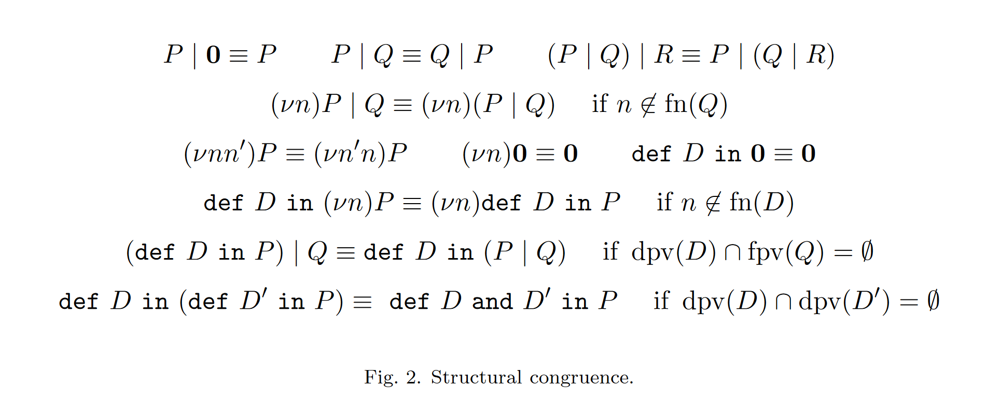

# Current Work
1) Table (Semantical Survey)
2) Dissertation
3) Property Tests  | Scala Check
4) Refinment Types | Liquid Types

# Next Step
- Table
- Fix Recursion (syntax: def X in G)
- Fix Recursion (Projection by Synchronous)
- Bug Hunting
- Network Semantics
- ICE | fst: March->April | snd: April-12
- 2024/May => FACS 15/05 - Fundamental Aspects of Component Softwares
- 2024/_   => ICORE

- add examples in papers
- gerar animacao para as semanticas 2/3
- capitulo de implementacao/feature que tenho
- 05/03 10h
- Corinne/ Oven / Choreo / Jullien Lange, Emilio Tuosto, Nobbuko 
- details on the tools ()

chapter:
- 
-
-
-
-

# Semantics
### Previous Papers
- Branching Pomsets
- Less-is-More
- Multiparty Asynchronous Session Types
- Spy (Python)
- MPST C: http://mrg.doc.ic.ac.uk/publications/multiparty-session-c-safe-parallel-programming-with-message-optimisation/tools12.pdf
### New Papers 
- Observational Equivalence for Multiparty Sessions
- A Theory of Formal Choreographic Languages
- Synchronous Multiparty Session Types
- Precise subtyping for synchronous multiparty sessions

# Framework:
- freely mix semantics and grammars
- compatability errors (prossibly)

# Tables
## Properties
| Label      | Property                              |
| ---------- | ------------------------------------- |
| PropertyA  | concerned with session initialisation |
| PropertyB  | synchronous or asynchronous           |
| PropertyC  | has parallel?  (implementation?)      |
| PropertyD  | has recursion? (implementation?)      |
## References
| Label      | Reference                                                                        |
| ---------- | -------------------------------------------------------------------------------- |
| ReferenceA | Multiparty Asynchronous Session Types                                            |
| ReferenceB | Synchronous Multiparty Session Types                                             |
| ReferenceC | API Generation for Multiparty Session Types, Revisited and Revised Using Scala 3 |
| ReferenceD | Branching Pomsets: Design, Expressiveness and Applications to Choreographies     |
| ReferenceE | A Very Gentle Introduction to Multiparty Session Types                           |
## Mapping
| Reference  | PropertyA | PropertyB    | PropertyC    | PropertyD      | ---------- | SpecialPropertyA  | SpecialPropertyB | SpecialPropertyC        | SpecialPropertyD  | SpecialPropertyE     |
| ---------- | --------- | ------------ | ------------ | -------------- | ---------- | ----------------- | ---------------- | ----------------------- | ----------------- | -------------------- |
| ReferenceA | yes       | asynchronous | interleaving | fixed point    | ---------- | MPST introduction | ---------------- | ----------------------- | ----------------- | -------------------- |
| ReferenceB | yes       | synchronous  | interleaving | fixed point    | ---------- | ----------------- | sort multicast   | ----------------------- | ----------------- | -------------------- |
| ReferenceC | no        | asynchronous | interleaving | NA             | ---------- | ----------------- | ---------------- | SOP/Scala 3 match types | ----------------- | -------------------- |
| ReferenceD | no        | asynchronous | interleaving | kleene closure | ---------- | ----------------- | ---------------- | ----------------------- | branching pomsets | -------------------- |
| ReferenceE | no        | synchronous  | NA           | fixed point    | ---------- | ----------------- | ---------------- | ----------------------- | ----------------- | just an introduction |

## Properties Worth Mentioning  
- Semantical Survey
    - concerned with session initialisation
    - synchronous vs asynchronous communications
    - recursion (when present how is it implemented?, pay attention to tail recursion)
    - parallel  (when present how is it inplemented?, development does not reach session types, local parallel)
- Projectability Restrictions
    - well-guardness
    - ...
- Special/Unique Properties

## Notes on the References
### Multiparty Asynchronous Session Types
- concerned with session initialisation  
##### Interaction + Branching:
- p->p': k\<U\>.G', k belongs to channels and U belongs to values
- p->p': k{lj: Gj}, k belongs to channels and l belongs to labels
- no reflexive interactions
##### Sequence:
- asynchronous communication
##### Parallel:
- free interleaving
- no common roles between branches  
infinite unfolding
##### Recursion:
- fixed point as μX.G  
##### End

### Synchronous Multiparty Session Types
- multicast over sorts
- high order communication
- concerned with session initialisation
##### Interaction + Branching:
- p->{p1,...,p2}: {m1,...,mr} <~S>.G', m belongs to messages and S belongs to sorts
- p->p'': m\<T@q\>.G'
- p->{p1,...,pr}: {m1,...,mr} {lh: Gh}, m belongs to messages and l belongs to labels
- no reflexive interactions
##### Sequence:
- synchronous communication
##### Parallel:
- no common roles between branches
infinite unfolding
##### Recursion
- fixed point as def X in G
- projection(r, rec X G) -> rec X (projection(r, G)) if r in G     
##### End
**simplify as structural congruence**

### API Generation for Multiparty Session Types, Revisited and Revised Using Scala 3
- not concerned with session intilialisation
##### Interaction + Branching:
- no reflexive interactions
##### Sequences:
- asynchronous communication
##### Parallel:
- interleaving allowed
- no common interactions between the branches allowed
##### Recursion:
- NA
##### Branching:
- branches with same roles but different messages
##### End

### Branching Pomsets: Design, Expressiveness and Applications to Choreographies
- not concerned with session initialisation
##### Sequence:
- asynchronous communication
##### Parallel:
- free interleaving
##### Recursion:
- Kleene's Closure
##### Incation as 0

### A Very Gentle Introduction to Multiparty Session Types
I like this paper because it uses synchronous communications and does not have parallel composition.  
As such, it serves as a placeholder.  
If I find a paper that enforces this qualities but goes into greater detail and brings new stuff to the table, this one can be overriden.
- not concerned with session initialisation  
##### Sequence:
- synchronous communication  
##### Parallel:

##### Recursion:
- Fixed Point as μX.P  
##### End as 0

### Dynamic Multirole Session Types
- allows actors to join/leave session in progress
- concerned with session initialisation  
##### Sequence:
- asynchronous communication  
##### Parallel:
- ???  
##### Recursion:
- fixed point as μX.G  
##### End

### Less is More: Multiparty Session Types Revisited
I have to re-read this one in order to select

### Hybrid Session Verication through Endpoint API Generation
implementation over scribble

### Implementing Multiparty Session Types in Rust
implementation over scribble

### A Theory of Formal Choreogrhapic Languages
Well-Branchedness achieved through a selector S, where S is a participant that must appear in the head interaction of both branches and through it we should be able to distinguish the branches

# Meeting Notes
- Report acerca do semantic survey (diferencas entre eles)
- grouping dos papers por properties
- keywords que permitem a escolhas (parametros)
- Linguagem parameterisada gerada pela features escolhidas
-  

- rec. guarded
- p != q
- li != lj

values sent:
labels
sorts
labels + sorts

"labels in a type need to be pairwise distinct"?

"top-down" development of software <=> global/local view (a tool for choreography-based ...) 

# A Tool for Choreography-Based Analysis of Message-Passing Software (Tool Associated)

*communicating finite-state machines* (CFSM) as behavioural specifications of distributated components  
A system of CFSM consists of a finite number of automata which communicate with each other through unbounded FIFO channels.  
There are two channels for each pair of CFSM in the system, one in each direction.

\subsubsection{\textit{ChorGram}} a tool supporting the analysis and design of choreography-based development over \textit{communicating finite-state-machines (CFSMs)}.

\textit{ChorGram} ensures \textit{communication soundness} by checking if the \textit{CFSM} validates the \textit{generalised multiparty compatibility (GMC)} property, guaranteeing in the process that the projections of the generated global graph are equivalent to the original system.

The \textit{GMC} property consists of two parts:
\textbf{(1)} \textit{representability property} - requires that for each participant, the projection of the labelled transition system onto the participant yields an automaton that is bisimilar to the original machine,
\textbf{(2)} \textit{branching property} - whenever a branching occurs it corresponds to two independent (concurrent) interactions, or it corresponds to a choice that follows one of two scenarios:
\textbf{(1)} the choice is made by a single participant (the selector),
\textbf{(2)} if the participant behaves differently in two branches of the choice, then it must receive different messages in each branch (before the point where its behaviour differ).

\noindent \textit{ChorGram} functionalities:
\begin{itemize}
    \item ensures that a system of \textit{CSFM} validates the \textit{GMC}
    \item returns a choreography which faithfully captures the interaction of the original system. 
\end{itemize}

"[...] our approach can be used to give feedback to protocol designers.
Hence, we are considering integrating ChorGram with a framework [...] allowing programmers to obtain real-time feedback wrt. the multiparty compatibility of the system they are designing."

"Currently, the prototype highlights communication mismatches at the local level and it is sometimes difficult to identify the real cause of such errors [...].
However, it appears that a (possibly partial) global graph can help giving precise feedback to the developer so that they can fix the error(s) easily."

- ChorGram extended to *communicating timed automata* (CTA);
- underlying concepts extended to two programming languages;
- Diogenes + ChorGram

Properties:
- *representability condition* - for each paticipant, the projection of the finate labelled transition system ono the participant yields an automaton that is bisimilar to the original machine
- *branchig condition* - whenever abranching occours in the labelled transition system then either (1) the branching comutes, i.e., it corresponds to two independent (concurrent) interactions, or (2) it corresponds to a choice and the following constrainsts must be met:
1) the choice is made by a single participant
2) if a participant is not the selector but behaves differently in two branches of the choice, then it must receive different messages in each branch (before the point where its behaviour differ).

# Corinne, a Tool for Choreography Automata (Tool Associated)

- corinne is implmented over c-automata.
- global graphs are more general than c-automata, providing the means to express parallelism.
- corinne does not support parallelism.
- chorinne sync | chorgram async (problem)
- reduce complexity from well-branchedness check

## Future Works
- corinne can already take as an input global graphs produced by chorgram (without parallelism)
- corinne <= chorgram integration
- encoding parallelism as interleaving of independent transitions
- chorgram <= corinne integration
- 

"In order to reason on the correctness and properties of multiparty communication protocols, dedicated models such as conversation protocols, choreographies, global graphs, and multiparty session types have been proposed."

"Their common trait is to provide global descriptions of the behaviour of a distributed system, and to allow one to ensure desirable properties such as deadlock freedom by checking some structural conditions on the model.
Also, they provide an operation, called projection, to extract from the global specification a description of the (local) behaviour that each participant has to follow in order to implement the desired global behaviour."

"C-automata [...] are Finite-State Automata (FSAs) whose transitions are labelled by interactions
of the form A−→B : m; such interaction represents a communication between participants A and B
where the former sends a message (of type) m to the latter, which is supposed to receive m."

**the concept of composition of c-automata**
[...] "the composition of systems is essentially obtained by taking two systems, selecting two of their participants (one per system) provided that they meet some compatibility conditions, and removing them while redirecting communications to them towards the other system."

**Properties (well-formedness):**
- well-branchedness
- well-sequencedness
Nonetheless, it is based on c-automata, there is no parallel.
(as of 2021)

# Notes
- show examples of projections happening
- we are trying to check if multiparty sessions describing Processes are well typed
- Scribble => MAsyncST 
- choreography as a mean to express the message exchange
- mpst as mean to type verify it
- statically validate it 
- safe networks

To Do:
- allow for local specification

# Papers Queue
- Global Progress in Dynamically Interleaved Multiparty Sessions
- Distributed Dynamic Verification with Session Types and Python
- Multiparty Session Types Meet Communcating Automata
# Dissertation References

# A Very Gentle Introduction to Multiparty Session Types
- re-check typing onward
- check its references

- different take on the parallel?

- interesting well-formedness requirement on the last rule (deal with it as a well formedness requirement vs at projection) - proj(p->q:Gi, r), we need to make sure tbhat continuation is the same on all branches 

merge is an interesting concept, how can I extend it?

- subtyping (from other [6][3] e discussed in [5])

# The Scribble Protocol Language
- From Scribble to MPST through MAsyncST
- Focus on financial protocols
- "A conversation in the present context means a series of interactions among two or more participants which follow a prescribed scenario of interactions"
- This scenario is the type of that conversation which we call protocol.

### Scribble purposes:
- Describe protocols of conversation for applications [...] statically validate if the resulting descriptions are consistent [...].
- Generate code prototypes and associated runtine paramenters (FSM) from stipulated protocols [...].
- Describe conversation scenarios of a distributed application which use these protocols, as conversation models. Statically validate if the resulting models use protocols correctly[...]
- Elaborate protocols and conversation models with assertions (logical formulae).[...]
- Develop (& debug) endpoint applications which release given conversation models with incrimental validation [...]
- Statically validate if the application have specific desirable properties[...].
- Offer a tractable and unambiguous specification of software tools and infrastructture needed for achieving these goals.

## Projection and Verifications:
- The well-formedness conditions on global protocols allow the projection to safely discard all messages actions not involving C (i.e., messages between A and S).
- The endpoint languages used in the Scribble industry projects, however, are mainstream engineering languages like Java and Python that lack the features, such as first-class communication channels with linear resource typing or object alias restriction, required to make static session typing feasible.
- In Scribble practice, the Conversation API is used to perform the relevant conversation operations natively in these languages, making static MPST type checking intractable.
- [...] is designed to focus on dynamic verification of endpoint behaviour.
- Endpoint monitoring by the local Conversation Runtime is perfomed by concerting local protocools to communicating finite state automata, for which the accepted languages correspond to the I/O action traces permited by the protocol.
- The conversion from syntactic Scribble local protocols to FSA extends the algorithm in [11] to support subprotocols and interrupts, and to use nested FSM for parallel conversation threads to avoid the potential state explosion from constucting their product.
- In addition, since the monitor verifies both messages dispatched by the endpoint and into the network and the message inbound to the endpoint from the network, each conversation monitor is able to protect the local endpoint within an untrusted network and vice versa.

## Conversation API
...

## Extensions of Scribble: Subprotocols and Interrutpts
...

## Extensions of Scribble: Parameterised Scribble
...

# API Generation for Multiparty Session Types, Revisited and Revised Using Scala 3
## Introduction
- API process
    - local types interpreted "operationally" as DFAs
    - DFAs encoded as APIs
- verify absence of communication errors, by providing:
    - deadlock freedom (a process can allways terminate or reduce)
    - protocol compliance (if processes can terminate or reduce, then the protocol allows it)
- avoid oversequentialization thorough Weak Seq? or parallel?
- parallel construct as a relaxed form allowing free interleave - re-read
- references in MPST theory and MPST pratice are extremely important
- [23] the only API tool with featuring parallel?
### Contribtutions
    - advantage of [14] to interpret local types as sets of pomsets (SOPs)
    - scala 3 match types to encode SOPs into APIs, the enconding relies on these static capabilities (the encoding cannot be ported to Java)
    - the use of match types in API Gen is new ([40] e [41] usam scala 3 features but not mach types)
## MPST Theory in a Nutshell 
    - end as the empty protocol
    - p!=q
    - ti != tj (deterministic continuations)
    - projection -> pay attention to last p->q 
    - [10] comm(G1) intersec comm(G2) = empty
    - "plain merge" being used vs "full merge"[39]
    - P1 || P2 is intended to implement one role (no comm between P1 and P2)
    - P1 . P2
    - well-typedness
## DFA-based API Generation
- DFA encoded as "state-as-classes" encoding
- DFA encoded as "states-as-types-parameters"
    - APIs with a smaller memory footprint
    - match types
- Local Types as DFAs interpretation
- first discorvered in [11]
- "final states of the interpretations of L1,...,Ln are superimposed to form a single new final state."
- [L1||L2]DFA is well-defined due to the well-formedness requirement that the sets of send and receives that occur in L1 and L2 are disjoint - verify this
### DFA to APIs - Using Classes
